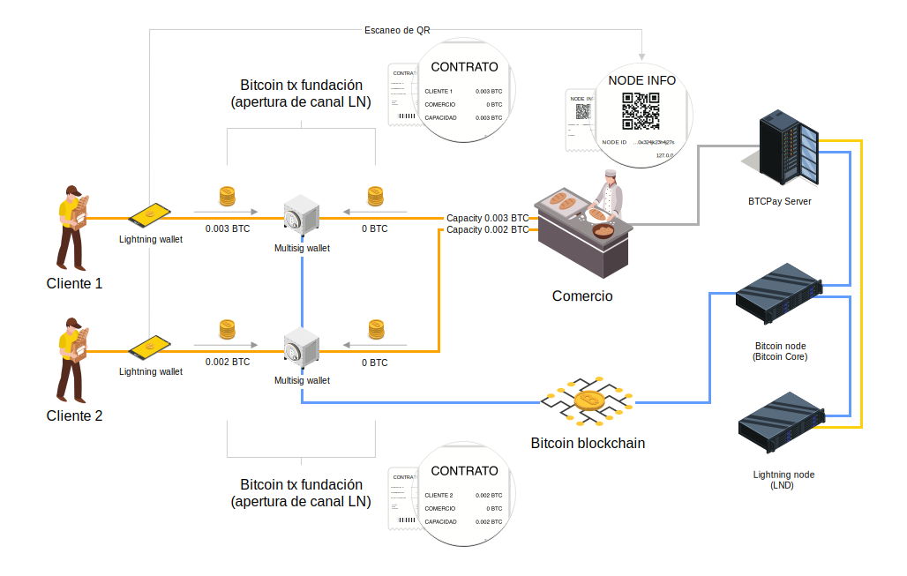
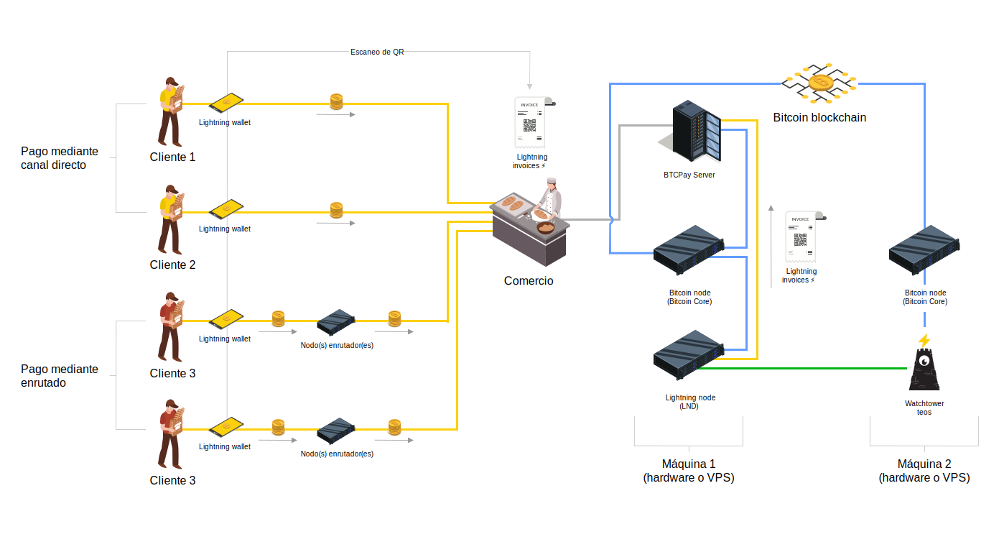

# Lightning Network en comercios
Guía para la implementación de Lightning Network en comercios usando BTCPay Server para gestionar ambos tipos de comercio (online y offline).

> Ten en cuenta que esta guía está en constante evolución y es un acercamiento personal hacia la implementación de Lightning en comercios.

## Introducción
Esta guía busca hacer la implementación basándose en el control y libertad total o casi total. Dependerás de ti mismo, con tu propio nodo, credenciales, hardware wallet, etc. Es un setup más complejo pero tendrás el control total sobre tus fondos.

Si quieres comenzar de forma "fácil y rápida" puedes usar un servicio como [Breez](https://breez.technology/#business) en donde tendrás todo listo para la venta offline (comercio sin venta online), también [muun](https://muun.com/es/). Debes tener en cuenta que al utilizar estas soluciones de terceros te conectarás probablemente a su propio nodo por lo tanto no será la opcion más privada ni segura. Al final de esta guía tienes un tutorial de como implementar Breez.

> Recordatorio: esta guía no pretende sumergirse profundamente en conceptos técnicos ni definiciones pero sí servir de punto de partida para la implementación. Si necesitas profundizar en algún concepto puedes buscar en la web o hacerme una consulta en Twitter [@danielpcostas](https://twitter.com/danielpcostas).

## Recibir pagos en Lightning Network
Para que un comercio pueda recibir pagos es fundamental que la wallet que quiere enviar el pago (el cliente) encuentre un camino hacia el nodo (el comercio) que emite la factura. Ese camino (canal o ruta) también tiene que tener balance y capacidad suficiente para poder enviar el pago.

La wallet del cliente escaneará la factura y buscará un camino para poder entregar el pago. Si encuentra un camino que cumpla con las necesidades se mostrará que se puede efectuar el pago y posiblemente unas pequeñas comisiones de "enrutado". Esas comisiones son otros nodos "enrutadores" por el que pasa el pago y que permiten la conexión entre la wallet del cliente y el nodo destino del comercio.

En la imagen se muestran canales con líneas y flechas indicando el flujo. En este ejemplo se ha encontrado un camino (o ruta) hacia el nodo del comercio.

Si la wallet no encuentra un camino tienes la posibilidad de abrir un canal de pago directo con el comercio. Tienes que pensar si es un comercio con el que seguirás efectuando compras ya que abrir y cerrar un canal incurre en comisiones on-chain (Bitcoin).

## Apertura de canales directos con comercio

En el siguiente diagrama se aprecia el proceso de apertura de canales directos con el comercio. En un primer momento el cliente escanea con su wallet Lightning la informacion del nodo del comercio al que quiere conectarse para abrir el canal. 

El establecimiento del canal crea un contrato inteligente entre las dos partes, permitiendo a cada parte realizar pagos, conocer el balance en cada momento y reclamarlo en caso de finalizacion de la relación financiera.

## Liquidez entrante
Cuando trabajamos con comercios y queremos recibir pagos es fundamental establecer canales con liquidez entrante con nodos bien conectados. Una posible idea sería abrirlos con nodos que se encuentren en el top 10. Puedes revisar esa información en [https://1ml.com](https://1ml.com). Recuerda que no eres tú quien debe abrirlos sino estos nodos hacia tí ya que si los abres tú, el balance estará de tu lado imposibilitando que puedas recibir pagos (solo podrás enviarlos).

Existen servicios en los que puedes comprar liquidez entrante, por ejemplo: 
* [Thor Lightning Channel Capacity de Bitrefill](https://www.bitrefill.com/buy/lightning-channel/)
* [LND Pool](https://lightning.engineering/pool/)
* [LNBIG](https://lnbig.com)
* [zerofeerouting](https://zerofeerouting.com)

>Por favor investiga las condiciones antes de hacerlo ya que algunos servicios cerrarán el canal si no hay pagos en un determinado tiempo.

Es importante que recuerdes que esos nodos no solo deben darte liquidez entrante sino que también deben estar bien conectados ya que la idea es que los clientes puedan pagarte a través de otros nodos haciendo un enrutado del pago sin tener que abrir un canal directo con tu comercio.

## Diagrama general

En el siguiente diagrama se puede apreciar un caso de ejemplo donde un comercio offline por la parte derecha tiene montada la infraestructura necesaria para aceptar pagos en Lightning y por la izquierda vemos a los potenciales clientes.

Algunos clientes pagan con canales directos mientras que otros lo hacen mediante nodos enrutadores.

En la parte de infraestructura se aprecian dos máquinas, una conteniendo todo el software necesario para la operacion del comercio y otra máquina que funcionará como torre de vigilancia (watchtower) para proteger nuestros fondos en Lightning.

Para realizar un pago, el comercio debe generar una factura Lightning y mostrarla o enviarla al cliente. Si fuese un e-commerce, se generaría la factura en el momento de la compra.
Una vez creada la factura, el cliente debe escanearla con su wallet de Lightning y proceder al pago.

## Idea
La idea general de implementación será:
* Instalar BTCPay Server en Linux, usando hardware propio o un VPS en la nube
* Montar los nodos de Bitcoin y Lightning Network en el hardware
* Configurar BTCPay Server para nuestra tienda online/offline
* Configurar nuestra hardware wallet
* Realizar pruebas en Testnet
* A tener en cuenta cuando participes en Lightning Network:
  * Costo de las transacciones on-chain de apertura y cierre de canales
  * Debes tener el nodo online 24/7
  * Para mayor seguridad usa Watchtowers (para vigilar "Protocol breach force close" channels)
  * En el hardware y software que utilices
    * Encendido automático ante fallas eléctricas
    * Encendido de servicios automáticos ante fallas (crashes)
    * Reconexión automática de red ante fallas del ISP/router
    * Tener logfiles para evaluar problemas
  * Backup de canales (Static Channel Backup) encriptados y frases semillas de la wallet on-chain
  * Decide si vas a vender en Sats o Fiat. De esto dependerá la expiración de las invoices de LN
    * Sats: 24h sería correcto y cómodo.
    * Fiat físico: 1 min cantidad fija (quizá lo más seguro) o 10 min cantidad no fija (lo calculará la wallet del pagador al enviar su pago)
    * Fiat online: 15 min cantidad fija

## Conceptos básicos a considerar
El comercio que quiera implementar pagos en Lightning Network debe plantearse varias cosas. Por el momento voy a ir planteando algunas preguntas que se me ocurren.
Por ejemplo:
* ¿Tiene un mínimo de conocimiento en Bitcoin?
* ¿Conoce cómo funciona una wallet de Bitcoin o Lightning? ¿Sabe diferenciar si es custodial o no custodial?
* ¿Entiende los riesgos que conlleva?
* ¿Tiene un mínimo de conocimiento en cómo manejar su privacidad y la seguridad de sus fondos / nodo?

## Hardware
Puedes usar otro hardware similar que encuentres en el mercado. Incluso comprar de segunda mano.
* Ordenador con 8GB RAM / 1TB disco SSD
* Cold Card Wallet (o cualquier hardware wallet, puede ser Ledger Nano por ejemplo)
* Teléfono móvil o tablet para usar como POS (punto de venta) en tiendas físicas

## Software
* [Linux Ubuntu Server 22.04](https://ubuntu.com/download/server)
* [BTCPay Server](https://docs.btcpayserver.org/Docker/)
  * Bitcoin Core
  * LND
* Si vas a vender online
  * Una página web con [WordPress](https://wordpress.org/download/) (podría ser también con Prestashop, Magento, Shopify, etc.)
  * [WooCommerce](https://wordpress.org/plugins/woocommerce/)
  * [BTCPay for WooCommerce V2](https://wordpress.org/plugins/btcpay-greenfield-for-woocommerce/)

## Costos de operación
* Inversión en hardware o "alquiler" de VPS
* Costo eléctrico y de conexión a Internet (solo si usas hardware)
* Costo de abrir y cerrar canales (transacciones on-chain). Estos dependen de los costes de minería en la blockchain en ese momento
* Costo de rebalanceo de canales. Puede que cada tanto necesites rebalancear canales, el coste es variable y está determinado por la red
* Costo de comprar liquidez entrante (inbound liquidity) si no puedes obtenerla de otros nodos
* Costo de mantenimiento o soporte técnico

## Legislación
Sección pendiente de desarrollo.

## Bitcoin Testnet tBTC faucet
Puedes probar todo este setup usando la red de Bitcoin en Testnet, para ello tienes los siguientes faucets para obtener un poco de tBTC y realizar pruebas.
* https://coinfaucet.eu/en/btc-testnet
* https://testnet-faucet.mempool.co
* https://bitcoinfaucet.uo1.net
* https://testnet.help/en/btcfaucet/testnet

## Lecturas de interés
* [LNBits para pequeños comerciantes](https://darthcoin.substack.com/p/lnbits-para-comerciantes)

## Lecturas técnicas
* [Mastering the Lightning Network](https://github.com/lnbook/lnbook)
* [Lightning Invoice Expiration: UX Considerations](https://d.elor.me/2022/01/lightning-invoice-expiration-ux-considerations/)

## Recursos de interés
* [Lightning Decoder](https://lightningdecoder.com) - Decodificación de facturas LN
* [Flyers para comercios](https://github.com/pedromvpg/bitcoinforlocalbusiness) - Para ayudar a comprender cómo y por qué deberían aceptar bitcoin como forma de pago
* [Como aceptar pagos con Breez](https://www.youtube.com/watch?v=Y_LevE5mqc4) - Tutorial
* [Infografías de LN](https://github.com/LatiNodos/Infografias) - Conceptos iniciales Lightning
* [LND: Tor & Clearnet - How to setup hybrid-mode](https://github.com/blckbx/lnd-hybrid-mode)

## Colaboración
Si quieres colaborar con esta guía puedes hacerlo directamente enviando un [PR](https://github.com/danielcharrua/ln-en-comercios/pulls) o un [issue](https://github.com/danielcharrua/ln-en-comercios/issues). También puedes comunicarte directamente conmigo en Twitter [@danielpcostas](https://twitter.com/danielpcostas).

Si ves algún error o tienes información para aportar y que esto ayude a otros no dudes en comentarlo así acercamos la economía Bitcoin a más personas.

Las imagenes utilizadas son libres de derechos de uso y fueron tomadas de Pexels y Freepik.

## Send some love

Si consideras que esta guía te ha aportado valor puedes enviar unos sats usando Lightning Network ⚡️
 

